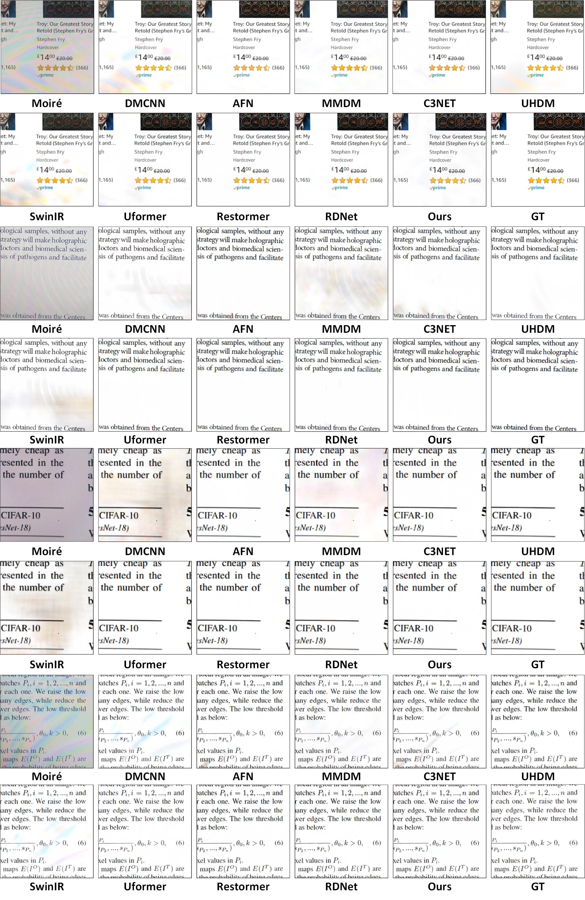
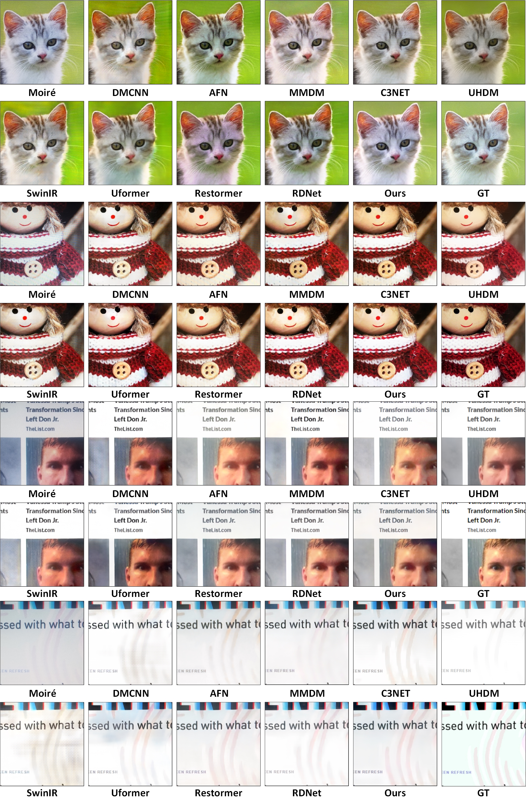
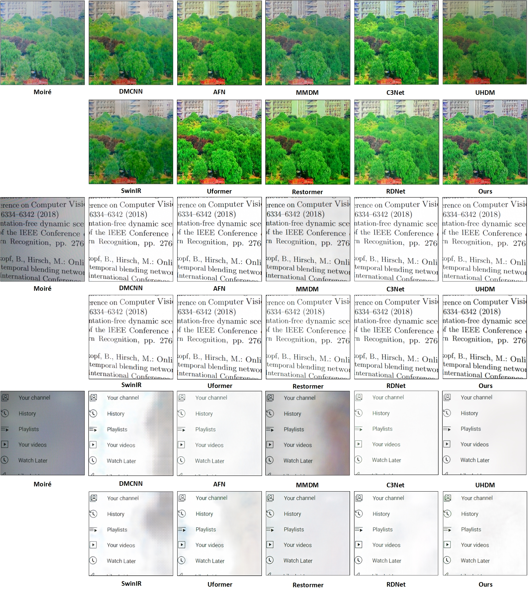

# FGWT

Frequency-Guided Wavelet Transformer for Effective Moiré Pattern Removal


## Dependencies and Installation

- Ubuntu 20.04.6 LTS
- Python 3.8.20
- NVIDIA GPU + CUDA 11.7
- Pytorch-GPU 2.0.0


## Test

1. [Downloading the Dataset](https://pan.baidu.com/share/init?surl=86tPHkRgr9eC9LpcRp59NA) key:(d6sz)
2. [Downloading the Pretrained Model](https://pan.baidu.com/s/1dk8S5Rs6YXheov9DiuXAaw) key:(qzqh)
3. Fill in the file path.

```python

python test.py

```
## Comparison




